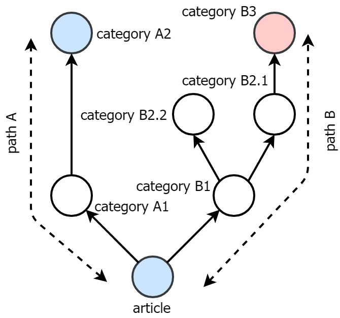

# A tool for labelling Wikipedia articles
Wiki-mapper is intended to simplify and speed up the process of manual labelling of Wikipedia articles (i.e. for the purpose of preparing datasets for various Natural Language Processing tasks such as text classification, entity linking, topic modelling).
It allows to quickly search articles and categories by title as well as efficiently traverse category tree.
The main idea behind the tool is the ability to assign a label to an article or to a category. 
When a label is assigned to a category, it is automatically inherited by its child categories and articles. 
Since it's legal for an article or category to have multiple parents, every node in a graph can possibly have many inherited labels.
Label conflicts are resolved in the following way:
- For every path leading from unlabelled node to all of its labelled parent nodes, select the label connected with the shortest path.
- When there are multiple paths of the same, shortest length, select the most frequently ocurring label among those paths. In the case of a tie, select label arbitrarily.

Fig 1: Selection algorithm. Article inherits blue label from Category A2 instead of red label from Category B3 since path A has length of 2 and path B has length of 3.

Using the tool, I was able to label almost 90% of polish Wikipedia articles (1,1 mln pages) in a few hours.
Additionally, new pages can be automatically labelled using the inheritance rules, after you download newer Wikipedia dump.

### Usage

The repository contains Spring Boot backend and TypeScript frontend. There are also sample wikipedia files in the `sample_data` directory. After unpacking `sample_data.7z`, the directory should contain:
- `page.csv, articleParents.csv, categoryParents.csv` - Files extracted using Wikipedia Miner toolkit from polish Wikipedia dump.
- `labels.json` - A list of possible labels for our task in JSON format. You can prepare the file yourself for the needs of your NLP task.
- `mappingLog.csv` - The file generated by this tool. It contains manually created mapping of 1.1 milion Wikipedia articles to labels defined in `labels.json` file.

In order to run the tool for sample data:

1. Compile the backend with maven `mvn package` and run with: `java -jar target/wiki-mapper.jar --data.path=sample_data`. The server should be running on port 8080.
2. Download npm dependencies in the client repository with `npm install` and run the client with `npm start`. Open `http://localhost:1234` in the browser.
